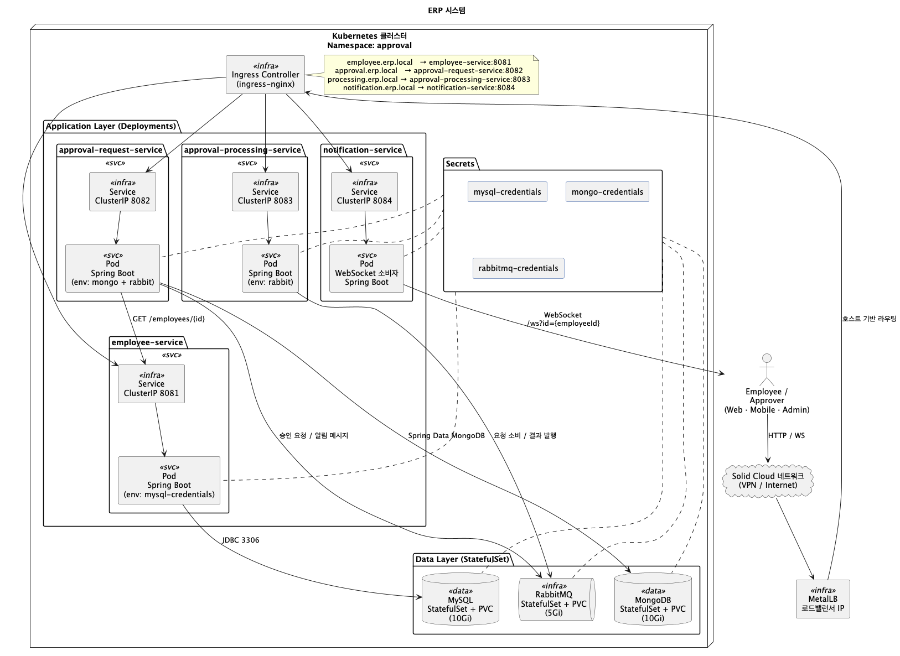
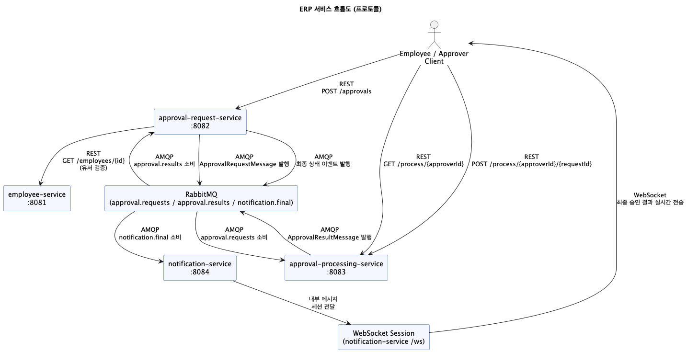

# ERP Approval System

ERP 승인 시스템은 직원 관리, 승인 요청/처리, 실시간 알림까지 포함한 마이크로 서비스 아키텍처입니다. 본 문서는 전체 구조, 호출 흐름, API 요약 및 실행 방법을 간단히 안내합니다.

## Architecture Overview



- `employee-service`: MySQL(상태 저장) + REST API로 직원 CRUD 제공.
- `approval-request-service`: MongoDB에 승인 요청을 저장하고, RabbitMQ(`approval.requests`, `approval.results`, `notification.final`)로 이벤트를 발행/소비.
- `approval-processing-service`: 결재자별 대기 목록을 유지하며 REST 입력을 RabbitMQ 결과 메시지로 전환.
- `notification-service`: RabbitMQ `notification.final` 큐를 소비해 WebSocket `/ws?id={employeeId}`로 실시간 알림을 push.
- 데이터 계층(MySQL/MongoDB/RabbitMQ)은 StatefulSet + PVC로 배포하며, 모든 애플리케이션은 `ingress-nginx` + MetalLB IP를 통해 `*.erp.local` 호스트로 외부에 노출됩니다.

## Service Flow Diagram



1. Requester가 `POST /approvals`(approval-request-service)를 호출하면 MongoDB에 저장되고 RabbitMQ `approval.requests`에 메시지를 발행합니다.
2. approval-processing-service는 해당 큐를 소비해 결재자별 대기 목록을 유지하고, 결재자는 `/process` REST API로 승인/반려를 입력합니다.
3. 처리 결과는 RabbitMQ `approval.results`로 발행되며 approval-request-service가 MongoDB 상태를 갱신합니다.
4. 결재가 완료되거나 반려되면 approval-request-service가 `notification.final` 메시지를 발행하고, notification-service가 이를 소비해 WebSocket으로 최종 상태를 전달합니다.

## API Quick Reference

핵심 REST 엔드포인트 요약입니다. 전체 상세는 [`docs/api.md`](docs/api.md)를 참고하세요.

| Service | Method & Endpoint | Request | Response |
| --- | --- | --- | --- |
| Employee | `GET /employees` | `department?`, `position?` | `200 OK` – `[ { id, name, department, position } ]` |
| Employee | `POST /employees` | `{ name, position, department }` | `201 Created` – `{ id }` |
| Approval Request | `POST /approvals` | `{ requesterId, title, content, steps[] }` | `201 Created` – `{ requestId }` |
| Approval Request | `GET /approvals/{id}` | Path: `requestId` | 승인 문서(steps, finalStatus 등) |
| Approval Processing | `GET /process/{approverId}` | Path: approverId | 결재자 pending 리스트 |
| Approval Processing | `POST /process/{approverId}/{requestId}` | `{ status: approved|rejected }` | `{ status }` |
| Notification | `GET ws://.../ws?id={employeeId}` | Query: id | WebSocket 실시간 알림 |

## 실행 방법

상세 실행 절차와 운영 팁은 [`docs/get-started.md`](docs/get-started.md)를 참고하세요. 아래는 빠른 개요입니다.

### 1. Docker Compose (로컬)
```bash
cp env/secrets.example env/secrets   # 비밀번호 등 채우기
./scripts/deploy-docker-compose.sh
# 서비스 상태 확인
curl http://localhost:8081/actuator/health
```

### 2. Kubernetes (학교 VM)
1. VPN 연결 후 `./scripts/setup-local.sh`로 kubeconfig/도구 설치
2. `ENV_FILE=env/secrets ./scripts/bootstrap-cluster.sh approval`
3. `ENV_FILE=env/secrets ./scripts/deploy-datastores.sh approval`
4. `./scripts/deploy-apps.sh approval <레지스트리경로>`
5. MetalLB + Ingress 설치 후 `*.erp.local`을 `/etc/hosts`에 매핑

### 테스트 시나리오
`scripts/scenarios/common.sh` + `scenario*_*.sh`를 통해 CLI에서 다양한 검증을 실행할 수 있습니다.
```bash
# 예: 전체 승인, 반려, 동시성, 대기 목록, WebSocket 알림, 대량 제출
./scripts/scenarios/scenario1_full_approval.sh
./scripts/scenarios/scenario2_rejection.sh
./scripts/scenarios/scenario3_concurrent.sh
./scripts/scenarios/scenario4_pending.sh
./scripts/scenarios/scenario5_notification.sh
./scripts/scenarios/scenario6_bulk.sh
```
